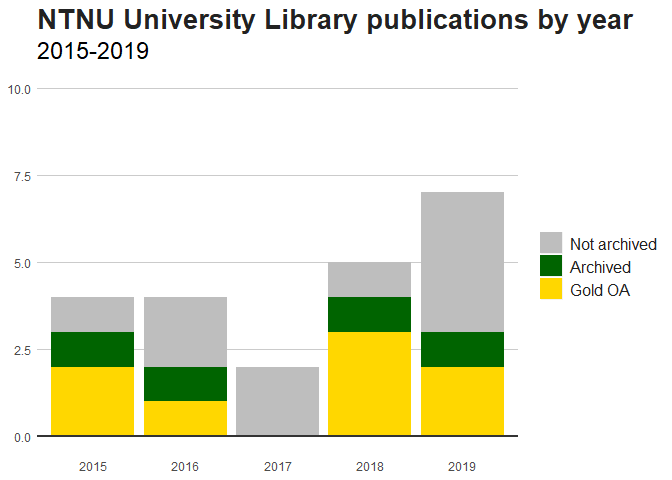

<!-- README.md is generated from README.Rmd. Please edit that file -->
rcristin
========

<!-- badges: start -->
<!-- badges: end -->
The goal of rcristin is to get results from the Norwegian academic publication database Cristin and return them as a data frame formatted according to analysis parameters provided.

Installation
------------

You can install the development version from [GitHub](https://github.com/) with:

``` r
# install.packages("devtools")
devtools::install_github("henrikkarlstrom/rcristin")
```

Example
-------

A simple query for academic publications from a unit, which is stored as a data frame:

``` r
library(rcristin)
## get Cristin results from NTNU's University Library
ntnuub <- get_cristin_results(unit = "194.14.30.0", published_since = 2015)
#> Joining, by = c("cristin_result_id", "open_access", "original_language", "url", "volume", "issue", "date_published", "created.date", "last_modified.date", "title_language", "title", "category.name.en", "publisher.name", "journal.name", "journal.publisher.name", "year_published", "year_reported", "year_online", "year_printed", "contributors.url", "journal.nvi_level")
```

This can now be used in standard analyses, like the number of publications per year:

``` r
library(ggplot2)
#> Warning: package 'ggplot2' was built under R version 3.5.3

# Graphing 
ntnuub$open_access <- forcats::fct_rev(factor(ntnuub$open_access))
ntnuub$open_access <- dplyr::recode(ntnuub$open_access,
                                    none = "Not archived",
                                    green = "Archived",
                                    gold = "Gold OA")
ggplot(data = ntnuub,
       aes(x = year_published,
           fill = open_access)) +
  geom_bar() +
  geom_hline(yintercept = 0,
             size = 1,
             colour = "#333333") +
  labs(title = "NTNU University Library publications by year",
       subtitle = "2015-2019") +
  theme(plot.title = element_text(size = 20,
                                  face = "bold",
                                  color = "#222222"),
        plot.subtitle = element_text(size = 18),
        legend.title = element_blank(),
        legend.text = element_text(size = 12,
                                   color = "#222222"),
        axis.title = element_blank(),
        axis.ticks = element_blank(),
        panel.grid.minor = element_blank(),
        panel.grid.major.y = element_line(color="#cbcbcb"),
        panel.grid.major.x = element_blank(),
        panel.background = element_blank()
        ) +
  ylim(0, 10) +
  scale_fill_manual(values = c("grey", "darkgreen", "gold"))
```


