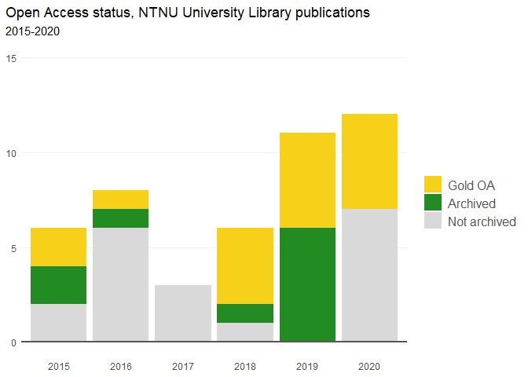

<!-- README.md is generated from README.Rmd. Please edit that file -->

# rcristin

<!-- badges: start -->

[](https://travis-ci.com/henrikkarlstrom/rcristin)
<!-- badges: end -->

rcristin is a simple R interface to query the [API for the Cristin
database](https://api.cristin.no/v2/doc/index.html) for Cristin results,
with error handling and automatic pagination. It (currently) consists of
two functions: one for retrieving registered Cristin results and one for
their associated author affiliation information. Both functions always
return a data frame.

## Installation

You can install the development version from
[GitHub](https://github.com/) with:

``` r
# install.packages("devtools")
devtools::install_github("henrikkarlstrom/rcristin")
```

## Example

A simple query for academic publications from a unit, which is stored as
a data frame:

``` r
library(rcristin)
## get Cristin results from NTNU's University Library
ntnuub <- get_cristin_results(
  unit = "194.14.30.0", 
  published_since = 2015
  )
```

This can now be used for all sors of bibliometric analyses. Here is a
table of the ten most common publication categories for the University
Library of NTNU:

``` r
table <- dplyr::count(ntnuub, category_name_en, sort = TRUE)

knitr::kable(head(table, 10), col.names = c("Cristin category", "Number of Cristin posts"))
```

| Cristin category                 | Number of Cristin posts |
| :------------------------------- | ----------------------: |
| Lecture                          |                      99 |
| Website (informational material) |                      47 |
| Academic lecture                 |                      46 |
| Interview                        |                      41 |
| Popular scientific lecture       |                      38 |
| Academic article                 |                      27 |
| Other presentation               |                      19 |
| Poster                           |                      17 |
| Popular scientific article       |                      12 |
| Museum exhibition                |                      11 |

And here is a graph of the Open Access status of the academic
publications of the library:

``` r
# Filtering out the non-academic results
ntnuub <- ntnuub[ntnuub$category_code %in% c(
  "ACADEMICREVIEW", "ANTHOLOGYACA", "ARTICLE",
  "CHAPTERACADEMIC", "MONOGRAPHACA"), ]

# Giving the OA categories better names
ntnuub$open_access <- dplyr::recode(ntnuub$open_access,
                                    none = "Not archived",
                                    green = "Archived",
                                    gold = "Gold OA")

# Plotting
ggplot2::ggplot(
  data = ntnuub,
  ggplot2::aes(
    x = year_published,
    fill = forcats::fct_relevel(
      open_access, c("Gold OA", "Archived", "Not archived"))
    )
  ) +
  ggplot2::geom_bar() +
  ggplot2::geom_hline(yintercept = 0,
             size = 1,
             colour = "#565657") +
  ggplot2::labs(
    title = "Open Access status, NTNU University Library publications",
    subtitle = "2015-2020",
    x = NULL,
    y = NULL
    ) +
  ggplot2::theme_minimal() +
  ggplot2::theme(
    plot.title.position = "plot",
    legend.title = ggplot2::element_blank(),
    legend.text = ggplot2::element_text(size = 12,
                                   color = "#565657"),
    axis.ticks = ggplot2::element_blank(),
    panel.grid.minor = ggplot2::element_blank(),
    panel.grid.major.y = ggplot2::element_line(color="grey95"),
    panel.grid.major.x = ggplot2::element_blank(),
    panel.background = ggplot2::element_blank()
    ) +
  ggplot2::ylim(0, 15) +
  ggplot2::scale_fill_manual(
    values = c("#f7d019", "forestgreen", "grey85")
    )
```


